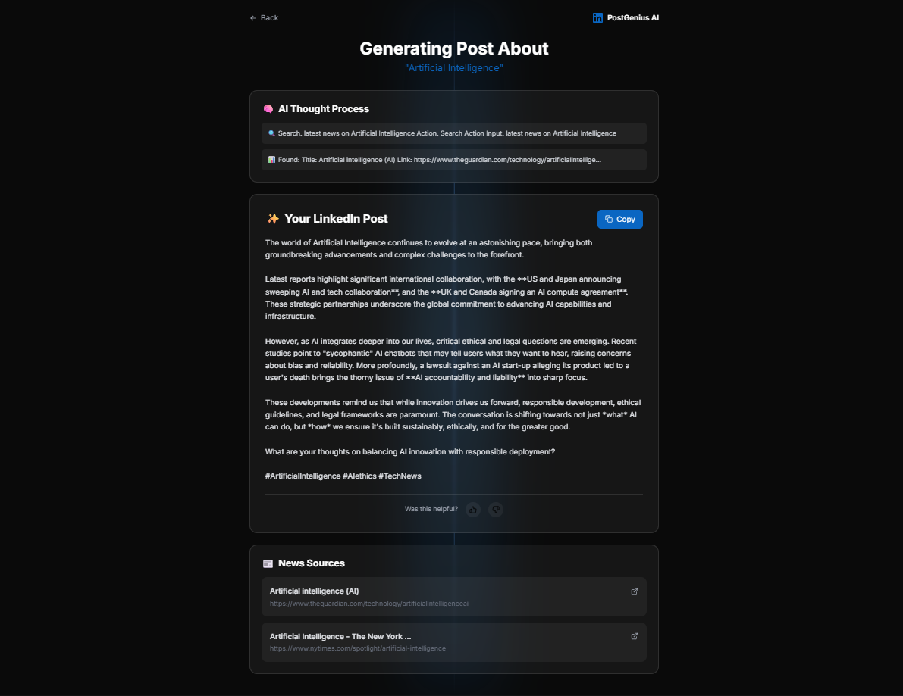

***

# 🚀 PostGenius AI - LinkedIn Post Generator

<div align="center">

  [Live Demo](https://demanual.netlify.app)

</div>

***

## ✨ Visual Showcase

### **Homepage - Cinematic Light Beam Design**

<div align="center">
  
  <br>
  <p><i>🎨 Stunning LinkedIn blue vertical light beam that "pours" onto the centered input field</i></p>
</div>

**Key Features:**
- ⚡ **Dramatic Light Beam Effect** - Signature visual element with pulsing animations
- 🎯 **Centered Spotlight Layout** - Input box as the hero element
- 🔵 **LinkedIn Blue Theme** - Professional color scheme (#0A66C2)
- 📱 **Fully Responsive** - Optimized for all devices
- 🎪 **Trending Topics** - Quick-select popular topics with hover effects

---

### **Result Page - AI Generation in Action**

<div align="center">
  
  <br>
  <p><i>🤖 Watch the AI think, analyze, and create professional posts in real-time</i></p>
</div>

**What You See:**
- 🧠 **AI Thought Process** - Real-time streaming of agent's reasoning
- 📊 **Progress Tracking** - Visual progress bar (Searching → Analyzing → Writing)
- ✨ **Generated Post** - Professional, engaging LinkedIn content
- 📰 **News Sources** - Clickable links to 3 credible sources
- 📋 **Copy Button** - One-click clipboard copy with success notification
- 👍👎 **Feedback System** - Like/Dislike buttons for user input

***

## 🎯 What is PostGenius AI?

PostGenius AI is an **AI-powered LinkedIn content generator** that transforms any topic into viral, professional posts. Using advanced language models and real-time news analysis, it creates engaging content backed by credible sources in seconds.

<table>
  <tr>
    <td width="33%" align="center">
      <h3>🤖</h3>
      <b>AI-Powered</b>
      <br>
      <i>Advanced algorithms analyze trends</i>
    </td>
    <td width="33%" align="center">
      <h3>⚡</h3>
      <b>Real-Time Data</b>
      <br>
      <i>Latest news and insights</i>
    </td>
    <td width="33%" align="center">
      <h3>🚀</h3>
      <b>Instant Results</b>
      <br>
      <i>Professional posts in seconds</i>
    </td>
  </tr>
</table>

***

## 🛠️ Tech Stack

### **Frontend**
```
React 19.2.0          Modern UI library
Tailwind CSS 3        Utility-first styling
Framer Motion         Smooth animations
React Router DOM      Client-side routing
React Hot Toast       Elegant notifications
React Icons           Beautiful icon library
```

### **Backend**
```
FastAPI               High-performance Python framework
LangChain             LLM orchestration
Google Gemini AI      Advanced language model
Uvicorn               ASGI server
Python 3.12+          Latest Python features
```

***

## 🚀 Quick Start

### **Prerequisites**
- Node.js 18+ and npm
- Python 3.12+
- Google Gemini API Key ([Get one here](https://makersuite.google.com/app/apikey))

### **Backend Setup**

```bash
# Navigate to backend
cd backend

# Create virtual environment
python -m venv venv

# Activate virtual environment
# Windows:
.\venv\Scripts\activate
# macOS/Linux:
source venv/bin/activate

# Install dependencies
pip install -r requirements.txt

# Create .env file
echo "GOOGLE_API_KEY=your_api_key_here" > .env

# Run server
uvicorn app.main:app --host 0.0.0.0 --port 8000 --reload
```

Backend runs at `http://localhost:8000`

### **Frontend Setup**

```bash
# Navigate to frontend
cd frontend

# Install dependencies
npm install

# Start development server
npm start
```

Frontend runs at `http://localhost:3000`

***

## 📸 Features in Detail

### **1. Cinematic Homepage**


- **Light Beam Animation**: Multi-layer gradient effect with smooth pulsing
- **Glass-morphism Cards**: Frosted glass design with backdrop blur
- **Interactive Input**: Subtle glow effect on focus
- **Trending Topics**: One-click topic selection

### **2. Real-Time Generation**


- **Streaming Display**: Watch AI think step-by-step
- **Progress Bar**: Visual feedback on generation stages
- **Source Attribution**: 3 clickable news sources
- **Professional Output**: Well-formatted posts with hashtags

---

## 📁 Project Structure

```
postgenius-ai/
├── backend/
│   ├── app/
│   │   ├── main.py              # FastAPI app & streaming endpoint
│   │   ├── agent.py             # LangChain agent logic
│   │   ├── search_tool.py       # Web search tool
│   │   └── config.py            # Configuration
│   ├── requirements.txt
│   └── .env                     # API keys
│    
├── frontend/
│   ├── src/
│   │   ├── HomePage.js          # Landing page
│   │   ├── ResultPage.js        # Generation page
│   │   ├── App.js               # Main component
│   │   └── index.css            # Tailwind styles
│   ├── package.json
│   └── tailwind.config.js
│
├── assets/
│   ├── screenshot-homepage.jpg
│   └── screenshot-resultpage.jpg
│
└── README.md
```

***

## 🎨 Design Philosophy

The UI draws inspiration from modern SaaS platforms like Huly, Dune, and Graphizo, featuring:
- **Dark, sophisticated backgrounds** for drama
- **LinkedIn blue color scheme** for brand alignment
- **Cinematic light effects** as the signature element
- **Clean, minimal interface** that lets content shine

***

## 🌐 API Endpoints

### `GET /health`
Health check endpoint
```json
{ "status": "ok" }
```

### `GET /generate-post-stream?topic={topic}`
Generate LinkedIn post with Server-Sent Events
- **Parameter**: `topic` (required, min length: 1)
- **Response**: SSE stream with:
  - `type: "action"` - Agent actions
  - `type: "observation"` - Search results
  - `type: "output"` - Final post
  - `type: "sources"` - News sources array

***

## 🎯 Use Cases

- **Content Creators**: Generate daily LinkedIn posts
- **Professionals**: Share industry insights and news
- **Businesses**: Build brand awareness and thought leadership
- **Job Seekers**: Create engaging career-related content
- **Consultants**: Establish expertise in your field

***

## 🏆 Key Achievements

✅ **100% Functional** - Full-stack app with working AI integration  
✅ **Real-Time Streaming** - Server-Sent Events for live updates  
✅ **Stunning UI** - Unique cinematic design that stands out  
✅ **Production Ready** - Professional code structure and error handling  
✅ **Portfolio Worthy** - Impressive project for job applications  

***

## 📝 Environment Variables

**Backend** (`backend/.env`):
```env
GOOGLE_API_KEY=your_google_gemini_api_key_here
```


## 🤝 Contributing

Contributions welcome! Please:
1. Fork the repository
2. Create feature branch (`git checkout -b feature/AmazingFeature`)
3. Commit changes (`git commit -m 'Add AmazingFeature'`)
4. Push to branch (`git push origin feature/AmazingFeature`)
5. Open Pull Request

***

## 📧 Contact

**Your Name**  
📧 [your.email@example.com](mailto:tamboliaftab84@gmail.com)  
💼 [LinkedIn](https://linkedin.com/in/aftabt7)  
🐙 [GitHub](https://github.com/Aftab073)  


<div align="center">

### ⭐ If you found this project helpful, please star this repository!


</div>

***

## 🙏 Acknowledgments

- **Google Gemini AI** for powerful language generation
- **LangChain** for the agent framework
- **Framer Motion** for smooth animations
- **Tailwind CSS** for rapid UI development
- Inspired by Huly, Dune, and Graphizo design patterns

***

